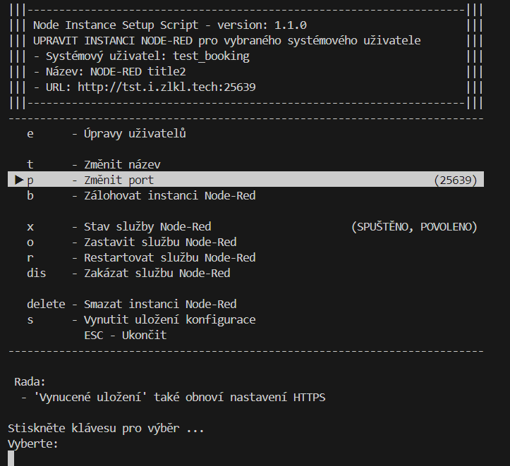

# JBLibs

Soubor pomocných knihoven

## c_menu

Knihovna pro tvoření interaktivních a dynamických menu

**Aktuální info v komentářích knihovny:**

[dokumentace](c_menu.md)

**Příklad menu:**

## systemdService

Správa UNIX systemd service a timer, aktuální vlastnosti v komentářích knihovny

[dokumentace](systemdService.md)

## helper

Různé funkce, více viz komentáře knihovny

Správa textů jazyků [dokumentace](helper.md) aktuální verze jsou v knihovně

## term

Knihovna pro ANSI ovládání terminálu a vstup z něj

Více viz komentáře v knihovně

## input

Základní vstupy z klávesnice, jako heslo, obecný input, anyKey, confirm

Víc v komentářích knihovny
