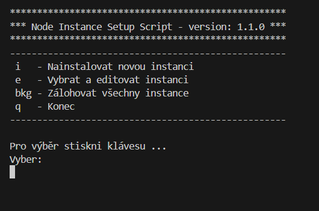
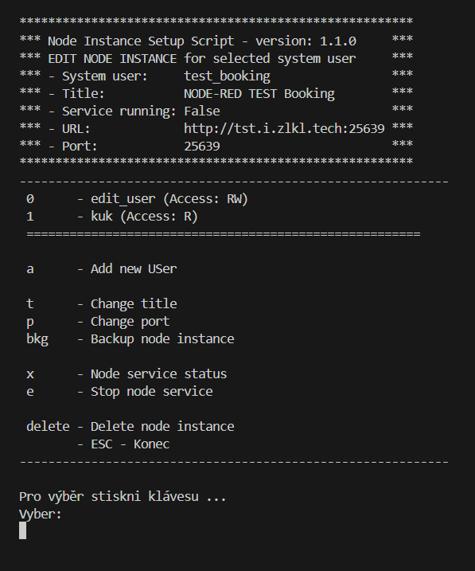
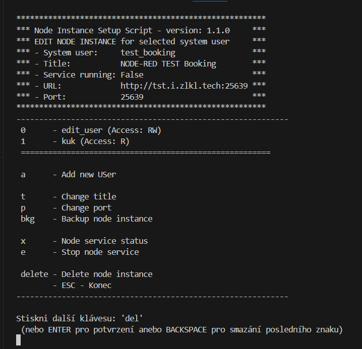

# Dokumentace třídy `c_menu`

Třída `c_menu` poskytuje rámec pro vytváření a správu interaktivních konzolových menu v Python aplikacích. Nepoužívá knihovnu `curses`, ale pouze escape sekvence, a jejím primárním účelem není barevné zobrazování, ale praktičnost a rychlý výběr s co nejintuitivnějším ovládáním. Podporuje různé funkce, včetně vlastních položek menu, uživatelsky definovaných akcí a struktury vícestupňových menu. Třída `c_menu` se nepoužívá přímo, ale je určena k rozšíření prostřednictvím dědiců.

## Přehled tříd

### 1. `c_menu_item`

Reprezentuje jednotlivou položku menu s možnostmi pro přizpůsobení.

#### Vlastnosti

- `label (str)`: Zobrazený název položky menu.
  - Speciální hodnoty:
    - `'-', '=', '+', '_'`: Zobrazí se jako oddělovací čáry.
- `choice (str)`: Klávesová zkratka nebo sekvence kláves pro tuto položku. Pokud je kratší text obsažen v delším, automaticky se nevyvolá, ale čeká na potvrzení stiskem Enter. Automaticky se vyvolá pouze nejdelší volba, například pokud existují možnosti 'f' (refresh) a 'full' (fullBackup), delší volba se vybere až po zadání celé sekvence kláves.
- `data (Any)`: Data předávaná vybranými funkcemi jako je např. `onSelect`, a tato data jsou předána pomocí třídy `onSelReturn` v property `data`.
- `onSelect (Callable["c_menu_item"], onSelReturn)`: Funkce volaná při výběru této položky.
- `onAfterSelect (Callable[[onSelReturn, "c_menu_item"], None])`: Funkce volaná po provedení `onSelect`.
- `enabled (bool)`: Určuje, zda je položka dostupná k výběru. Pokud není zapnuta, je místo volby zobrazen text např. '/DIS/' nebo '/VYP/'.
- `hidden (bool)`: Pokud je `True`, položka se skryje.
- `atRight (str)`: Text zobrazený na pravé straně položky.

#### Metody

- `__init__(label, choice, onSelect, onAfterSelect, data, enabled, hidden, atRight)`: Inicializuje položku menu s danými atributy.

### 2. `onSelReturn`

Používá se pro správu odpovědí po výběru položky menu, např. vrácené z funkce `onSelect`.

#### Vlastnosti

- `err (str)`: Chybová zpráva zobrazená po výběru, pokud je nastavena. Stejně tak `ok` zobrazuje potvrzující zprávu. Pokud nejsou nastaveny, nezobrazí se.
- `ok (str)`: Potvrzující zpráva zobrazená po výběru.
- `data (Any)`: Data předaná funkci `onAfterSelect`.
- `endMenu (bool)`: Pokud je nastavena na `True`, ukončí menu.

#### Metody

- `__init__(err, ok, data, endMenu)`: Inicializuje instanci s chybovými a potvrzovacími zprávami a ovládacími příznaky.

### 3. `c_menu`

Hlavní třída menu, určená k rozšíření pro konkrétní aplikace. Menu se automaticky stará o minimální šířku z položek `title` a `subTitle` a následně voleb menu, které mohou mít dva texty: text volby a popisu, a pravý informační text, který je zarovnaný od pravé strany. Třída `c_menu` se nepoužívá přímo, ale je určena k rozšíření prostřednictvím dědiců.

#### Vlastnosti

- `menu (list[c_menu_item])`: Seznam položek menu. Můžeme je definovat v následovníkovi jako pevné položky menu, nebo můžeme dynamicky měnit při vstupu do menu (jednou) pomocí `onEnterMenu`, anebo opakovaně před zobrazením (refresh) pomocí `onShowMenu`.
- `title (str)`: Titulek zobrazený nahoře menu.
- `subTitle (str)`: Podtitulek zobrazený pod titulkem.
- `afterTitle (str)`: Další text zobrazený pod titulkem a menu.
- `afterMenu (str)`: Text zobrazený na konci menu.
- `lastReturn (onSelReturn)`: Ukládá výsledek posledního volání `onSelect`.
- `onEnterMenu (Callable[[], None])`: Funkce volaná před prvním zobrazením menu.
- `onShowMenu (Callable[['c_menu'], None])`: Funkce volaná před každým zobrazením menu.
- `onShownMenu (Callable[['c_menu'], None])`: Funkce volaná po každém zobrazení menu.
- `onExitMenu (Callable[['c_menu'], Union[None, bool]])`: Funkce volaná při ukončení menu. Pokud z callable funkce vrátíme `False`, menu se neukončí a exit bude zablokován.
- `choiceBack (c_menu_item)`: Položka menu pro funkci "Zpět" v podmenu. Pokud `None`, tak se nezobrazí a nebude aktivní.
- `ESC_is_quit (bool)`: Pokud je `True`, stisk ESC ukončí menu a automaticky přidá řádek volby 'ESC - Zpět'.
- `choiceQuit (c_menu_item)`: Položka menu pro funkci "Konec". Pokud nastavíme na `None`, nebude zobrazena ani aktivní.

#### Metody

- `__init__()`: Inicializuje novou instanci menu.
- `__getList() -> list[c_menu_item]`: Vrací seznam položek menu, včetně možností zpět a konec.
- `processList(lst, onlyOneColumn, spaceBetweenTexts, rightTxBrackets, minWidth, linePrefix)`: Formátuje a zpracovává seznam položek pro zobrazení.
- `printBlok(title_items, subTitle_items, charObal, leftRightLength, charSubtitle, eof, space_between_texts, min_width)`: Zobrazuje blok textu s volitelnými okraji.
- `__print(lastRet) -> int`: Tiskne menu, zobrazí všechny položky a oddělovače.
- `searchItem(choice) -> Tuple[c_menu_item, bool]`: Hledá položku menu podle klávesové zkratky.
- `checkItemChoice(list) -> Union[None, List[str]]`: Kontroluje duplicitní klávesové zkratky v položkách menu.
- `run_refresh(c, first) -> bool`: Obnovuje zobrazení menu a zpracovává vstup.
- `run(item)`: Spustí menu, umožňuje interaktivní navigaci a výběr položek. Pokud je voláno menu z jiné položky menu, je tato položka předána do run a následně zkopírována do `self._runSelItem`.

## Ukázka použití

```python
from libs.JBLibs.c_menu import c_menu, c_menu_item, onSelReturn
from libs.JBLibs.input import confirm, anyKey

# Vytvoření hlavního menu
class MainMenu(c_menu):
    def __init__(self):
        super().__init__()
        self.title = "Hlavní menu"
        self.menu = [
            c_menu_item("Možnost 1", "1", self.delete_action),
            c_menu_item("Možnost 2", "2", SubMenu()),  # Odkaz na podmenu
            c_menu_item("-", ""),  # Oddělovač
            c_menu_item("Konec", "q", lambda i: onSelReturn(endMenu=True))
        ]
    def delete_action(self,selItem:c_menu_item) -> onSelReturn:
      anyKey() # zobrazí zprávu stiskni klávesu
      

# Vytvoření podmenu
class SubMenu(c_menu):
    counter:int=0

    def __init__(self):
        super().__init__()
        self.title = "Podmenu"
        self.ESC_is_quit = True  # ESC bude ukončovat podmenu
        self.menu = [
            c_menu_item("Pod-možnost 1", "1", self.confirm_action),
            c_menu_item("Pod-možnost 2", "2", example_action)
        ]

    def confirm_action(self,selItem:c_menu_item) -> onSelReturn:
      confirm("Opravdu se přejete provést akci ?")

    def refreshHead(self):
        self.title=defTitle()+"EDIT NODE INSTANCE for selected system user "
        x=[
            "System user:     "+funkce_get_user(),
            "Title:           "+funkce_het_user(),
            "Service running: "+get_service_status(),
        ]
        self.subTitle="\n".join(x)

    def onEnterMenu(self):
        self.refreshHead()

        log.debug("- enter some edit text")
        self.selectedSystemUSer=self._runSelItem.data
        self.cfg=cfg_data(self._runSelItem.data)

    def onShowMenu(self):
        self.menu=[]
        menu.extend([
            c_menu_item("Add new USer "+str(self.counter),'a',self.addNewUser),
            c_menu_item("Del USer",'del',self.delUser),
        ])
        self.counter+=1

    def addNewUser(self,selItem:c_menu_item) -> onSelReturn:
        pass

    def delUser(self,selItem:c_menu_item) -> onSelReturn:
        pass


# Spuštění hlavního menu
menu = MainMenu()
menu.run()
```

## Poznámky

- **Rozšíření** `c_menu`: Doporučuje se rozšířit `c_menu` pro přidání specifického chování a přepisů pro konkrétní aplikace.
- **Ošetření chyb**: Použijte `onSelReturn` pro správu a zobrazení chybových zpráv na základě akcí uživatele.
- **Vícestupňové menu**: Podmenu lze vytvořit nastavením `onSelect` na jinou instanci `c_menu`.

## Náhled



